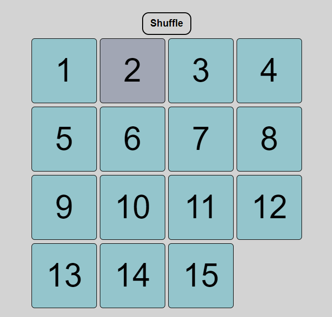
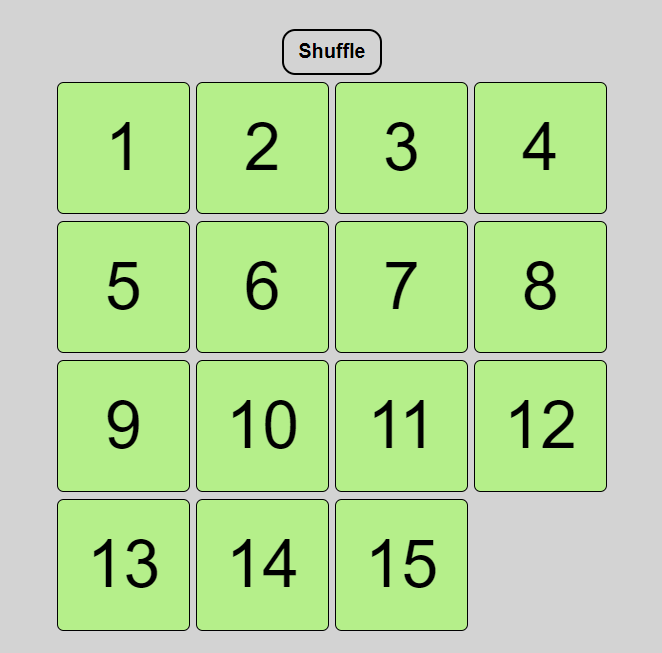

# Project 1 

## Idea - 15 Puzzle

## Overview
A fifteen puzzle is a simple puzzle game. The goal is to get the numbered tiles in order from 1-15.

## Wireframes / Screenshots
Upon Page Load

During Gameplay

Upon Completion

## User Stories
- choose when to start
- click on the square to move it
- play again / shuffle button
- hover effect to identify which piece I'm about to move

## Plan of Attack
- build 3/3 board - Done
- "remove" 1 piece and maintain grid - Done (done by assigning a class 'empty' to the piece)
- build piece movement - Done 
- get shuffle/starting placement to work - Done
- get restart/shuffle button working - Done
- expand to 4x4 - Done
- get move count to work
- // event listener (Done, console logged out - seems to be more correct that the piece movement event listener)
- build check win (Do I give an array to match my divs to?) - Done
- get hover effect on piece - Done 
- any bonuses listed in User Stories I can get in time for turn in.

## Planned Future Enhancements
- count number of moves
- click to move 2/3 squares (entire column/row moves)
- Visual Movement instead of instant swaps
- dark mode / light mode
- have a timer + save fastest time
- use a (random?) image + fill in blank spot when puzzle is completed
- save and compare against lowest number of moves
- choose which solve counts (reverse, odds on top, evens on top, columns)